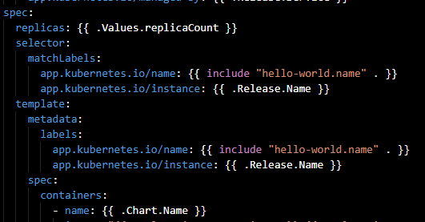

# helm-samples

Repo to store some helpful helm charts

## Installing helm client

Helm is separeted between two main components: helm client and tiller. Tiller is basically the helm server that stays inside a Kubernetes cluster. It's the component that
the helm client talks with. So, Helm client must be installed on a local machine and tiller will stay on the cluster.

First, lets install the helm binary. Find the corresponding binay to your OS in this [link](https://github.com/helm/helm/releases).
Download it, and extract like this:

``` shell
tar -zxvf <name_of_the_tar_file>
```

After doing that, you'll have a binary. Move this binary to the ```bin``` folder like this:

``` shell
mv <binary_name> /usr/bin/helm
```

Type ```helm``` in order to test it.

## Creating a chart

In order to create your helm deployment, do:

``` shell
helm create <name_you_want_to_give>
```

This will create a bunch of code and some folders. Lets do an quick explanation of the important parts:

- ```Templates Folder``` : in this folder, you will have all the yaml files that will be deployed, like deployments and services, for example.
- ```Chart.yml``` : this is the file with some metadata of this helm chart.
- ```values.yml``` : file with all the variables your templates will use during deploy, unless you override it with the ```--set``` parameter.

Look at this image below:



As you can see, there are the ```.Values```, ```.Release``` and ```.Chart``` names. The values for this variables are coming from:

- ```.Values``` : this is where the values that will enter the templates are in. It's source is the file ```.values.yaml```.
- ```.Release``` : special object that is created.
- ```Chart``` : this values are obtained via ```Chart.yaml```.

## Deploying a chart

Deploying a chart is really simple. To start tiller on the Kubernetes Cluster your context is set to, do:

``` shell
helm init
```

This will start tiller. After that, to deploy your chart, do:

``` shell
helm install --name myDeploy <name_you_gave>
```

That's all folks. Hope that helps!